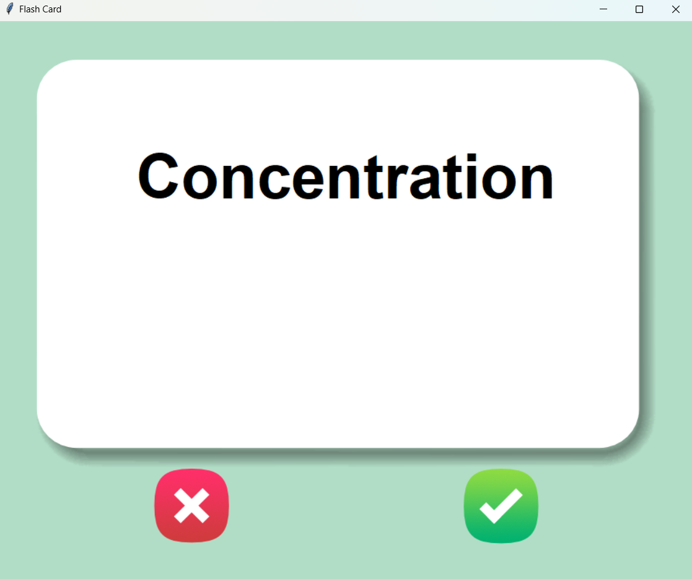
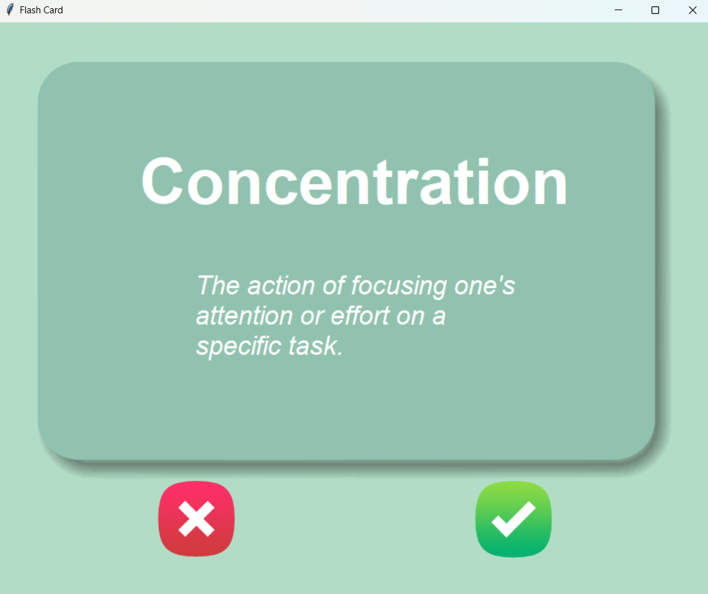

# Flashcard Game

 

The Flashcard Game is an interactive learning application developed with Python, tkinter, and Pandas. This game is designed to help you memorize and test your knowledge of words and their definitions. It presents flashcards with words on the front side, gives you time to think, then flips to reveal the definitions. You can mark words as "known" or "unknown" for further practice.


## Features

- Flashcards with words and definitions.
- Timer for thinking before revealing the definition.
- Ability to mark words as "known" or "unknown."
- Words marked as "unknown" are saved for future practice.
- User-friendly interface created with tkinter.

## Prerequisites

Before running the Flashcard Game, make sure you have the following prerequisites:

- **Python**: The game was developed using Python 3.11+.
- **Pandas**: You need to have the Pandas library installed. You can install it using `pip`:

```bash
pip install pandas
```

## Installation

Clone or download this repository to your local machine:

```bash
git clone https://github.com/makifcevik/flash_card_game.git
cd flashcard-game
```

Run the game:

```bash
python flashcard_game.py
```

## How to Play
- Flashcards will be displayed with words on the front side. Take your time to think about the definition of the word.
- After a few seconds, the card will automatically flip to reveal the definition.
- If you know the word, press the "Yes" button. The word will be removed from practice.
- If you don't know the word, press the "No" button. The word will be marked as "unknown" and saved for future practice.
- Continue practicing and improving your word knowledge.

## Customization

- You can customize your flashcards by editing the data file "words_to_learn.csv". Add new words and definitions or modify existing entries.
- A quick note that you need to launch the application at least once to see the "words_to_learn.csv" file so you can edit it and customize it however you like.
